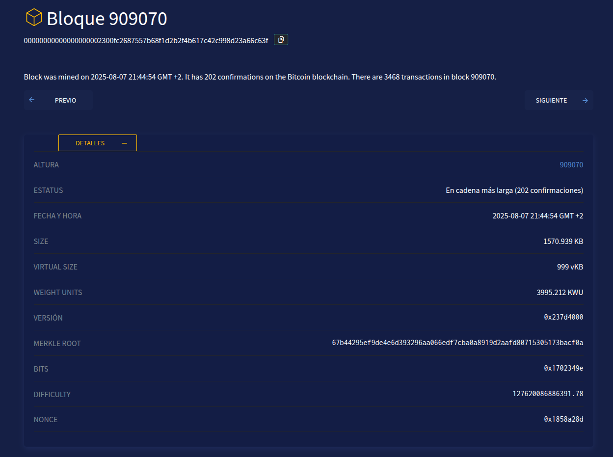

# Calculadora de Hash SHA-256 para Bloques de Bitcoin

## ¿Qué hace este programa?

Este script de Python calcula el **hash SHA-256** de un bloque de Bitcoin. Es una herramienta educativa para entender cómo funciona la tecnología blockchain y el proceso de minado de Bitcoin.

Surge de los comentarios recibidos después de publicar el LinkedIn el artículo [¿Tiene sentido minar bitcoins desde casa? (part I)](https://www.linkedin.com/pulse/tiene-sentido-minar-bitcoins-desde-casa-part-i-carlos-mart%C3%ADn-de-arcos-qs25f/?trackingId=2s6K31FzTpi1qautzIsdSA%3D%3D)

## ¿Qué es un hash SHA-256?

Un hash SHA-256 es como una "huella digital" única de los datos. Si cambias aunque sea un solo bit de información, el hash resultante será completamente diferente. Bitcoin usa este sistema para:
- Identificar cada bloque de forma única
- Verificar que los datos no han sido modificados
- Realizar el proceso de minado

## ¿Cómo funciona?

### 1. Estructura de un bloque Bitcoin
Cada bloque de Bitcoin tiene una **cabecera** con 6 campos importantes:
- **Versión**: Versión del protocolo Bitcoin
- **Hash del bloque previo**: Enlace al bloque anterior
- **Merkle Root**: Resumen de todas las transacciones
- **Timestamp**: Fecha y hora del bloque
- **Bits**: Nivel de dificultad del minado
- **Nounce**: Número que cambian los mineros para encontrar el hash correcto

### 2. Proceso del script
1. **Lee los datos** del archivo `.env` (o usa los valores por defecto del bloque [909070](https://btcscan.org/block/00000000000000000002300fc2687557b68f1d2b2f4b617c42c998d23a66c63f))
2. **Convierte cada campo** a formato binario (bytes)
3. **Une todos los campos** para formar la cabecera completa (80 bytes)
4. **Calcula el hash** usando doble SHA-256
5. **Muestra el resultado** en formato hexadecimal

## Instalación y uso

### Requisitos
- Python 3.6 o superior
- Librería `python-dotenv`

### Instalación
```bash
pip install python-dotenv
```

### Configuración
1. Copia el archivo de ejemplo:
   ```bash
   cp .env.example .env
   ```

2. Edita el archivo `.env` con los datos del bloque que quieras analizar:
   ```
   # Datos de la cabecera del bloque
   VERSION=0x237d4000
   HASH_BLOQUE_PREVIO=0x0000000000000000000083f7e2de7797878fb850ab2b606a81985bfa691b8b98
   MERKLE_ROOT=0x67b44295ef9de4e6d393296aa066edf7cba0a8919d2aafd80715305173bacf0a
   TIMESTAMP=1753710054
   BITS=0x1702349e
   NOUNCE=0x1858a28d
   
   # Variables para simulación de minado
   NOUNCE_START=0x0
   NOUNCE_RANGE=10000000
   ```

### Ejecución

**Para calcular el hash de un bloque:**
```bash
python sha256_calc.py
```

**Para simular el proceso de minado:**
```bash
python mining_simulation.py
```

## Ejemplos de salida

### sha256_calc.py
```
Version: 00407d23
Hash del bloque previo: 98b8b91b5f...
Merkle root: 0acf3b1751...
Timestamp: 36029568
Bits: 9e340217
Nounce: 8da25818
Cabecera (bytes): 00407d23...
Cabecera (longitud): 80 bytes
SHA-256: 00000000000000001e8d6829a8a21adc5d38d0a473b144b6765798e61f98bd1d
```

### mining_simulation.py
```
=== SIMULACIÓN DE MINADO BITCOIN ===
Probando 10.000.000 valores de nounce...
Bloque base: 909070

Nounce: 0 - Hash: 9b2de5a8085f039dff57b318d51702685e2492c32dbc251188c4115d021ddd5d
Nounce: 100.000 - Hash: f098a681ac08532bedbc51a1c38b2d24bee4264b2dfefdbc4c5eff466365d0c3
...

=== RESULTADOS ===
Tiempo total: 20,76 segundos
Hashes por segundo: 496.383
Nounce final probado: 9.999.999

=== BÚSQUEDA DEL HASH EXACTO DEL BLOQUE 909070 ===
Hash objetivo: 00000000000000000002300fc2687557b68f1d2b2f4b617c42c998d23a66c63f
Iniciando búsqueda desde nounce: 0
Rango de búsqueda: 10.000.000 valores

¡HASH ENCONTRADO!
Nounce correcto: 0x1858a28d (408.461.965)
Tiempo de búsqueda: 1,23 segundos
```

## Datos por defecto
Si no modificas el archivo `.env`, el script usará los datos del **bloque 909070** de Bitcoin como ejemplo.

## Bloque 909070 - Ejemplo

Este bloque se usa como ejemplo por defecto en el script. Puedes ver todos sus detalles en el explorador de bloques:



**Ver bloque completo:** [https://btcscan.org/block/00000000000000000002300fc2687557b68f1d2b2f4b617c42c998d23a66c63f?expand](https://btcscan.org/block/00000000000000000002300fc2687557b68f1d2b2f4b617c42c998d23a66c63f?expand)

**Datos de la cabecera:**
- **Hash del bloque:** `00000000000000000002300fc2687557b68f1d2b2f4b617c42c998d23a66c63f`
- **Versión:** `0x237d4000`
- **Hash del bloque previo:** `0x0000000000000000000083f7e2de7797878fb850ab2b606a81985bfa691b8b98`
- **Merkle Root:** `0x67b44295ef9de4e6d393296aa066edf7cba0a8919d2aafd80715305173bacf0a`
- **Timestamp:** `1753710054` (2025-08-07 21:44:54 GMT+2)
- **Bits:** `0x1702349e`
- **Nounce:** `0x1858a28d`

## Conceptos importantes

### Little-endian vs Big-endian
Bitcoin usa formato **little-endian**, que significa que los bytes se almacenan "al revés". Por ejemplo:
- Número: `0x12345678`
- Little-endian: `78 56 34 12`
- Big-endian: `12 34 56 78`

### Doble SHA-256
Bitcoin no usa SHA-256 una sola vez, sino **dos veces seguidas**:
```
Hash final = SHA-256(SHA-256(cabecera))
```

Esto proporciona mayor seguridad contra ciertos tipos de ataques.

## Scripts disponibles

### sha256_calc.py - Calculadora de hash
Script principal que calcula el hash SHA-256 de un bloque de Bitcoin usando los datos configurados en el archivo `.env`.

**Ejecución:**
```bash
python sha256_calc.py
```

### mining_simulation.py - Simulación de minado
Script que simula el proceso de minado de Bitcoin probando diferentes valores de nounce para encontrar el hash correcto.

**Funcionalidades:**
- Prueba 10.000.000 valores de nounce secuenciales
- Mide el rendimiento (hashes por segundo)
- Busca el hash exacto del bloque 909070
- Configurable mediante variables de entorno

**Variables de entorno para simulación:**
- `NOUNCE_START`: Valor inicial del nounce (por defecto: 0)
- `NOUNCE_RANGE`: Cantidad de valores a probar (por defecto: 10.000.000)

**Ejecución:**
```bash
python mining_simulation.py
```

**Ejemplo de configuración en .env:**
```
NOUNCE_START=0x1858a28a
NOUNCE_RANGE=10000000
```

## Archivos del proyecto
- `sha256_calc.py` - Script calculadora de hash
- `mining_simulation.py` - Script de simulación de minado
- `.env` - Configuración de variables (crear desde .env.example)
- `.env.example` - Ejemplo de configuración con datos del bloque 909070
- `README.md` - Este archivo de documentación
- `LICENSE` - Licencia MIT del proyecto
- `CHANGELOG.md` - Historial de cambios entre versiones

## Licencia

Este proyecto está bajo la Licencia MIT. Puedes usar, modificar y distribuir este código libremente, pero debes:
- Mantener el aviso de copyright original
- Incluir la licencia MIT en cualquier copia o distribución
- Indicar claramente las modificaciones que hayas realizado

Ver el archivo [LICENSE](LICENSE) para más detalles.

## Autor
Carlos Martín - 2025-08-08